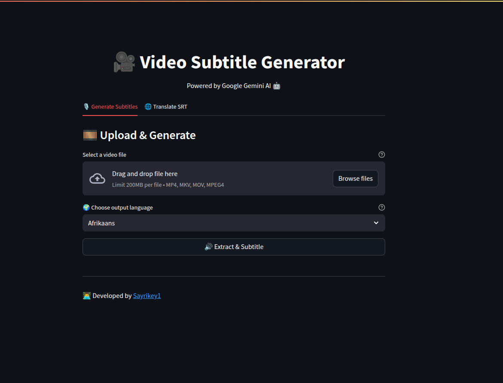
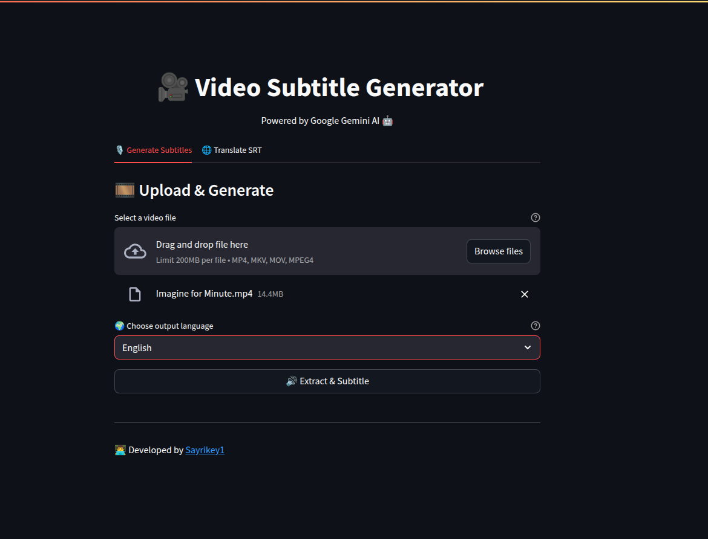
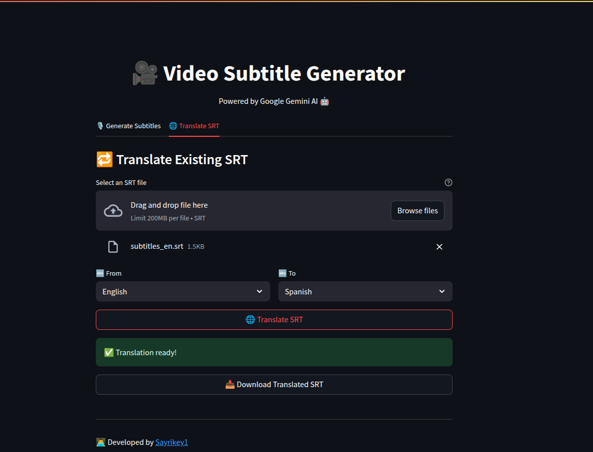
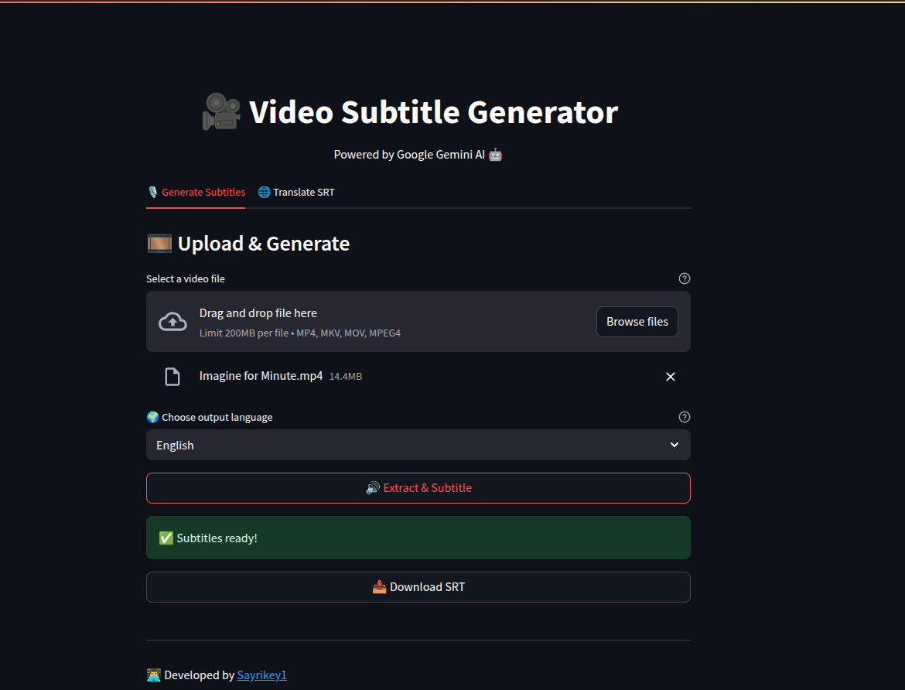

# 🎥 SubtitleGen: Video Subtitle Generator 🌍

A web application for generating and translating subtitles (SRT) for videos using the power of **Google Gemini AI**.
Extract audio from video files, generate accurate subtitles in multiple languages, and translate existing SRT files—all through a simple, intuitive Streamlit interface.

---

## ✨ Features

* **🔊 Extract Audio:** Upload a video file and extract its audio as a WAV file.
* **📝 Generate Subtitles:** Automatically transcribe audio and create strictly numbered SRT subtitles in your chosen language.
* **🌐 Translate SRT:** Translate existing SRT files between supported languages while preserving timing and numbering.
* **🤖 Powered by Google Gemini AI:** Leverages Gemini's advanced transcription and translation capabilities.

---

## 🛠️ Tech Stack

* **Backend:** FastAPI, ffmpeg-python, Google Generative AI (Gemini)
* **Frontend:** Streamlit
* **Languages & Tools:** Python 3.12, ffmpeg, dotenv for environment variables

---

## 🚀 Setup & Installation

1. **Clone the repository:**

   ```sh
   git clone <your-repo-url>
   cd sub-gen
   ```

2. **Install dependencies:**

   ```sh
   pip install -r requirements.txt
   ```

3. **Configure environment variables:**

   * Create a `.env` file in the project root with:

     ```dotenv
     GOOGLE_API_KEY=your_google_gemini_api_key
     ```

4. **Run the backend server:**

   ```sh
   uvicorn backend.main:app --reload
   ```

5. **Launch the frontend app:**

   ```sh
   streamlit run app.py
   ```

---

## 🎬 Usage Guide

1. **Open the Streamlit app** at [`http://localhost:8501`](http://localhost:8501) (for local development)  
   or try the **deployed app** at [https://video-sub-gen.streamlit.app/](https://video-sub-gen.streamlit.app/).
2. **Generate Subtitles:**

   * Upload a video file (`.mp4`, `.mkv`, `.mov`).
   * Select subtitle language & click **Generate**.
   * Download the `.srt` file.
3. **Translate SRT:**

   * Upload an existing `.srt`.
   * Choose source & target languages.
   * Click **Translate** and download the translated `.srt`.

---

## 🗣️ Supported Languages

Afrikaans, Albanian, Arabic, Bengali, Chinese, Dutch, English, French, German, Hindi, Italian, Japanese, Korean, Portuguese, Russian, Spanish, Swahili, Tamil, Turkish, Urdu, Vietnamese

---

## 📁 File Structure

```
backend/
    main.py           # FastAPI backend (API endpoints)
frontend/
    app.py            # Streamlit frontend
.env                  # Environment variables (API keys)
requirements.txt      # Python dependencies
```

---

## 📸 Images

Get a visual walkthrough of SubtitleGen in action:

<div style="display: grid; grid-template-columns: 1fr 1fr; gap: 10px;">
  
  
  
  
</div>

---

## 👨‍💻 Developer Notes

* Requires a valid **Google Gemini API** key.
* Ensure **ffmpeg** is installed and available in your system PATH.

---

## 📄 License

Released under the **MIT License**.
See `LICENSE` for details.

---

## 🤝 Author

Developed by [Sayrikey1](https://github.com/Sayrikey1)

